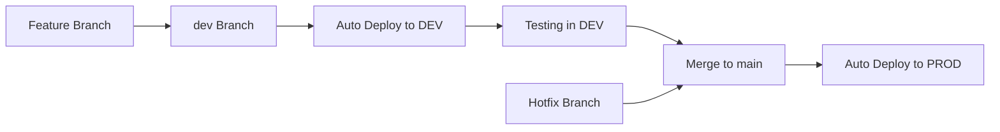

# Guía de Ambientes de Desarrollo - Render.com

## 📋 **RESUMEN EJECUTIVO**

Esta guía detalla la implementación de ambientes separados de desarrollo y producción en Render.com para la API del Club de Aguas Abiertas Chiloé, siguiendo las mejores prácticas de DevOps y proporcionando un flujo de desarrollo seguro y eficiente.

### **🎯 Objetivos**
1. Crear ambiente de desarrollo dedicado en Render.com
2. Separar completamente desarrollo y producción
3. Automatizar deployments por branches
4. Configurar variables de entorno por ambiente
5. Implementar estrategia de testing segura

---

## 🏗️ **ARQUITECTURA DE AMBIENTES**

### **Estado Actual vs Propuesto**

#### **📊 Estado Actual:**
```
┌─────────────────────────────────────────┐
│           SOLO PRODUCCIÓN               │
├─────────────────────────────────────────┤
│  Branch: main                           │
│  URL: api.aguasabiertaschiloe.cl       │
│  Database: Supabase Production          │
│  Variables: Production Environment      │
└─────────────────────────────────────────┘
```

#### **🎯 Arquitectura Propuesta:**
```
┌─────────────────────────────────────────┐
│              DESARROLLO                 │
├─────────────────────────────────────────┤
│  Branch: dev                            │
│  URL: dev-api.aguasabiertaschiloe.cl   │
│  Database: Supabase Development         │
│  Variables: Development Environment     │
└─────────────────────────────────────────┘
                    │
                    │ Merge → Auto Deploy
                    ▼
┌─────────────────────────────────────────┐
│              PRODUCCIÓN                 │
├─────────────────────────────────────────┤
│  Branch: main                           │
│  URL: api.aguasabiertaschiloe.cl       │
│  Database: Supabase Production          │
│  Variables: Production Environment      │
└─────────────────────────────────────────┘
```

---

## 🚀 **PLAN DE IMPLEMENTACIÓN**

### **FASE 1: CONFIGURACIÓN DE SUPABASE** 🗄️

#### **1.1 Crear Proyecto de Desarrollo en Supabase**

**Acciones requeridas:**
1. **Crear nuevo proyecto Supabase**
   ```
   Nombre: aachiloe-dev
   Región: Misma que producción (consistencia)
   Plan: Free tier (suficiente para desarrollo)
   ```

2. **Duplicar estructura de base de datos**
   ```sql
   -- Exportar schema desde producción
   -- Importar en ambiente de desarrollo
   -- Verificar que triggers y RLS funcionen
   ```

3. **Configurar Authentication**
   ```
   Providers: Email, Google OAuth
   Site URL: https://dev-api.aguasabiertaschiloe.cl
   Redirect URLs: 
   - https://dev-api.aguasabiertaschiloe.cl/auth/callback
   - http://localhost:3000/auth/callback (para desarrollo local)
   ```

4. **Poblar con datos de prueba**
   ```sql
   -- Script para crear usuarios de prueba
   -- Datos mock para reservas
   -- Horarios de ejemplo
   -- Eventos de prueba
   ```

#### **1.2 Variables de Entorno Supabase**
```env
# Desarrollo
SUPABASE_URL_DEV=https://[proyecto-dev].supabase.co
SUPABASE_ANON_KEY_DEV=eyJhbGciOiJIUzI1NiIsInR5cCI6...
SUPABASE_SERVICE_ROLE_KEY_DEV=eyJhbGciOiJIUzI1NiIsInR5cCI6...

# Producción (mantener existentes)
SUPABASE_URL_PROD=https://[proyecto-prod].supabase.co
SUPABASE_ANON_KEY_PROD=eyJhbGciOiJIUzI1NiIsInR5cCI6...
SUPABASE_SERVICE_ROLE_KEY_PROD=eyJhbGciOiJIUzI1NiIsInR5cCI6...
```

### **FASE 2: CONFIGURACIÓN DE RENDER.COM** ⚙️

#### **2.1 Crear Servicio de Desarrollo**

**Configuración del nuevo servicio:**
```yaml
# render-dev.yaml
services:
  - type: web
    name: aachiloe-api-dev
    env: node
    region: oregon
    plan: free
    branch: dev  # ⭐ CLAVE: Deploy desde branch dev
    buildCommand: npm install && npm run build && npx prisma generate
    startCommand: npm start
    healthCheckPath: /health
    envVars:
      - key: NODE_ENV
        value: development
      - key: PORT
        value: 10000
      - key: DATABASE_URL
        sync: false  # Configurar manualmente
      - key: SUPABASE_URL
        sync: false  # Usar variables de desarrollo
```

#### **2.2 Configurar Custom Domain**

**DNS Configuration:**
```dns
# Agregar nuevo registro CNAME
Tipo: CNAME
Nombre: dev-api
Valor: aachiloe-api-dev.onrender.com
TTL: 300
```

**Resultado:** `dev-api.aguasabiertaschiloe.cl` → Ambiente de desarrollo

#### **2.3 Variables de Entorno por Ambiente**

**Desarrollo (`aachiloe-api-dev`):**
```env
NODE_ENV=development
PORT=10000
DATABASE_URL=postgresql://[user]:[pass]@[host]:[port]/[db-dev]?schema=public
DIRECT_URL=postgresql://[user]:[pass]@[host]:[port]/[db-dev]?schema=public
SUPABASE_URL=https://[proyecto-dev].supabase.co
SUPABASE_ANON_KEY=[dev-anon-key]
SUPABASE_SERVICE_ROLE_KEY=[dev-service-key]
RESEND_API_KEY=[same-as-prod]  # Emails de prueba
CONTACT_EMAIL=dev-contacto@aguasabiertaschiloe.cl
RESEND_FROM_EMAIL=dev-noreply@aguasabiertaschiloe.cl
```

**Producción (`aachiloe-api`):**
```env
NODE_ENV=production
PORT=10000
DATABASE_URL=postgresql://[user]:[pass]@[host]:[port]/[db-prod]?schema=public
DIRECT_URL=postgresql://[user]:[pass]@[host]:[port]/[db-prod]?schema=public
SUPABASE_URL=https://[proyecto-prod].supabase.co
SUPABASE_ANON_KEY=[prod-anon-key]
SUPABASE_SERVICE_ROLE_KEY=[prod-service-key]
RESEND_API_KEY=[prod-resend-key]
CONTACT_EMAIL=contacto@aguasabiertaschiloe.cl
RESEND_FROM_EMAIL=noreply@aguasabiertaschiloe.cl
```

### **FASE 3: CONFIGURACIÓN DE CORS Y SEGURIDAD** 🔒

#### **3.1 Actualizar CORS por Ambiente**
```typescript
// api/src/index.ts - ACTUALIZAR
const allowedOrigins = process.env.NODE_ENV === 'production' 
  ? [
      'https://www.aguasabiertaschiloe.cl',
      'https://aguasabiertaschiloe.cl'
    ]
  : [
      'https://www.aguasabiertaschiloe.cl',  // Producción (para testing)
      'https://aguasabiertaschiloe.cl',      // Producción (para testing)
      'http://localhost:3000',               // Desarrollo local
      'http://localhost:3001',               // Desarrollo alternativo
      'https://dev-frontend-url.netlify.app' // Si hay frontend de dev
    ];

app.use(cors({
  origin: allowedOrigins,
  credentials: true
}));
```

#### **3.2 Rate Limiting por Ambiente**
```typescript
// api/src/middleware/rateLimitMiddleware.ts - ACTUALIZAR
export const createRateLimiter = (max: number, windowMs: number = 15 * 60 * 1000) => {
  return rateLimit({
    windowMs,
    max: process.env.NODE_ENV === 'production' ? max : max * 10, // Más permisivo en dev
    message: 'Too many requests from this IP',
    standardHeaders: true,
    legacyHeaders: false,
  });
};

// Aplicar límites más permisivos en desarrollo
export const apiLimiter = createRateLimiter(
  process.env.NODE_ENV === 'production' ? 100 : 1000
);

export const contactLimiter = createRateLimiter(
  process.env.NODE_ENV === 'production' ? 2 : 20, // 20 mensajes/hora en dev
  60 * 60 * 1000
);
```

### **FASE 4: ESTRATEGIA DE DEPLOYMENT** 🚀

#### **4.1 Flujo de Branches**


#### **4.2 Configuración de Auto-Deploy**

**Desarrollo (Automático):**
- **Branch**: `dev`
- **Deploy**: Automático en cada push
- **URL**: `https://dev-api.aguasabiertaschiloe.cl`
- **Base de datos**: Supabase Development

**Producción (Controlado):**
- **Branch**: `main`
- **Deploy**: Automático solo desde `main`
- **URL**: `https://api.aguasabiertaschiloe.cl`
- **Base de datos**: Supabase Production

#### **4.3 Verificación de Deployments**
```bash
# Scripts de verificación automática
#!/bin/bash

# Verificar ambiente de desarrollo
echo "🔍 Verificando ambiente de desarrollo..."
curl -f https://dev-api.aguasabiertaschiloe.cl/health || exit 1
curl -f https://dev-api.aguasabiertaschiloe.cl/api/auth/profile-status || exit 1

# Verificar ambiente de producción
echo "🔍 Verificando ambiente de producción..."
curl -f https://api.aguasabiertaschiloe.cl/health || exit 1
curl -f https://api.aguasabiertaschiloe.cl/api/auth/profile-status || exit 1

echo "✅ Ambos ambientes funcionando correctamente"
```

---

## 🧪 **ESTRATEGIA DE TESTING**

### **Testing en Desarrollo**
```bash
# Testing completo en ambiente de desarrollo
npm run test                    # Tests unitarios
npm run test:integration       # Tests de integración con DB dev
npm run test:e2e              # Tests end-to-end

# Testing de endpoints específicos
curl -X POST https://dev-api.aguasabiertaschiloe.cl/api/emails/contact \
  -H "Content-Type: application/json" \
  -d '{"nombre":"Test","email":"test@test.com","asunto":"Test","mensaje":"Testing"}'
```

### **Datos de Prueba**
```sql
-- Script para poblar ambiente de desarrollo
INSERT INTO users (auth_id, email, name, role, isActive, profileCompleted) VALUES
('dev-user-1', 'admin@test.com', 'Admin Test', 'ADMIN', true, true),
('dev-user-2', 'user@test.com', 'User Test', 'USER', true, true),
('dev-user-3', 'treasurer@test.com', 'Treasurer Test', 'TREASURER', true, true);

-- Horarios de prueba
INSERT INTO swimming_schedules (dayOfWeek, startTime, endTime, maxCapacity, isActive) VALUES
(1, '07:00:00', '08:00:00', 8, true),
(1, '18:00:00', '19:00:00', 8, true),
(2, '07:00:00', '08:00:00', 8, true);
```

---

## 📊 **MONITOREO Y LOGGING**

### **Diferenciación por Ambiente**
```typescript
// api/src/utils/logger.ts - ACTUALIZAR
import winston from 'winston';

const logger = winston.createLogger({
  level: process.env.NODE_ENV === 'production' ? 'info' : 'debug',
  format: winston.format.combine(
    winston.format.timestamp(),
    winston.format.errors({ stack: true }),
    winston.format.json(),
    winston.format.label({ 
      label: process.env.NODE_ENV === 'production' ? 'PROD' : 'DEV' 
    })
  ),
  transports: [
    new winston.transports.Console({
      format: winston.format.combine(
        winston.format.colorize(),
        winston.format.simple()
      )
    })
  ]
});

export { logger };
```

### **Health Checks Específicos**
```typescript
// api/src/routes/healthRoutes.ts - CREAR
import { Router } from 'express';
import { logger } from '@/utils/logger';

const router = Router();

router.get('/health', (req, res) => {
  const healthCheck = {
    status: 'OK',
    timestamp: new Date().toISOString(),
    environment: process.env.NODE_ENV,
    version: process.env.npm_package_version || '1.0.0',
    database: 'Connected', // Verificar conexión real
    supabase: 'Connected'  // Verificar conexión real
  };
  
  logger.info('Health check requested', healthCheck);
  res.status(200).json(healthCheck);
});

router.get('/health/detailed', (req, res) => {
  // Health check más detallado para desarrollo
  const detailedHealth = {
    ...healthCheck,
    memory: process.memoryUsage(),
    uptime: process.uptime(),
    environment_variables: {
      NODE_ENV: process.env.NODE_ENV,
      DATABASE_URL: process.env.DATABASE_URL ? 'Set' : 'Not Set',
      SUPABASE_URL: process.env.SUPABASE_URL ? 'Set' : 'Not Set'
    }
  };
  
  res.status(200).json(detailedHealth);
});

export default router;
```

---

## 🔧 **CONFIGURACIÓN DE FRONTEND**

### **Variables de Entorno Frontend**
```env
# Desarrollo (Netlify/Vercel)
NEXT_PUBLIC_API_URL=https://dev-api.aguasabiertaschiloe.cl
NEXT_PUBLIC_ENVIRONMENT=development

# Producción (Netlify/Vercel)
NEXT_PUBLIC_API_URL=https://api.aguasabiertaschiloe.cl
NEXT_PUBLIC_ENVIRONMENT=production
```

### **Configuración Dinámica**
```typescript
// frontend/lib/config.ts - CREAR
const config = {
  apiUrl: process.env.NEXT_PUBLIC_API_URL || 'http://localhost:3000',
  environment: process.env.NEXT_PUBLIC_ENVIRONMENT || 'development',
  isDevelopment: process.env.NEXT_PUBLIC_ENVIRONMENT === 'development',
  isProduction: process.env.NEXT_PUBLIC_ENVIRONMENT === 'production'
};

export default config;
```

---

## 📋 **CHECKLIST DE IMPLEMENTACIÓN**

### **FASE 1: Supabase Development** 
- [ ] **1.1** Crear proyecto Supabase de desarrollo
- [ ] **1.2** Duplicar estructura de base de datos
- [ ] **1.3** Configurar Authentication providers
- [ ] **1.4** Poblar con datos de prueba
- [ ] **1.5** Verificar triggers y RLS funcionando

### **FASE 2: Render.com Development**
- [ ] **2.1** Crear servicio `aachiloe-api-dev`
- [ ] **2.2** Configurar branch `dev` para auto-deploy
- [ ] **2.3** Configurar custom domain `dev-api.aguasabiertaschiloe.cl`
- [ ] **2.4** Configurar variables de entorno de desarrollo
- [ ] **2.5** Verificar SSL automático

### **FASE 3: Código y Configuración**
- [ ] **3.1** Actualizar CORS para múltiples ambientes
- [ ] **3.2** Ajustar rate limiting por ambiente
- [ ] **3.3** Configurar logging diferenciado
- [ ] **3.4** Crear health checks detallados
- [ ] **3.5** Actualizar scripts de deployment

### **FASE 4: Testing y Validación**
- [ ] **4.1** Verificar deployment automático desde `dev`
- [ ] **4.2** Testing completo de endpoints en desarrollo
- [ ] **4.3** Verificar separación de datos entre ambientes
- [ ] **4.4** Testing de flujo completo dev → prod
- [ ] **4.5** Documentar nuevos endpoints y procesos

### **FASE 5: Optimización y Monitoreo**
- [ ] **5.1** Configurar alertas de health checks
- [ ] **5.2** Implementar logging centralizado
- [ ] **5.3** Crear dashboard de monitoreo
- [ ] **5.4** Documentar procesos de troubleshooting
- [ ] **5.5** Training del equipo en nuevos procesos

---

## ⚡ **BENEFICIOS ESPERADOS**

### **🚀 Desarrollo Más Rápido**
- Testing seguro sin afectar producción
- Iteración rápida de features
- Debugging sin presión de usuarios reales

### **🛡️ Mayor Seguridad**
- Separación completa de datos
- Testing de cambios críticos
- Rollback más seguro

### **📈 Mejor Calidad**
- Testing exhaustivo antes de producción
- Detección temprana de bugs
- Validación de integraciones

### **👥 Mejor Colaboración**
- Ambiente compartido para testing
- Demos sin riesgo
- Feedback temprano de stakeholders

---

## 🚨 **CONSIDERACIONES IMPORTANTES**

### **💰 Costos**
- **Render.com**: $0/mes (plan free para desarrollo)
- **Supabase**: $0/mes (plan free para desarrollo)
- **DNS**: Sin costo adicional
- **Total**: $0/mes adicionales

### **⚠️ Limitaciones del Plan Free**
- **Cold starts** en ambiente de desarrollo (no crítico)
- **Límites de base de datos** (suficiente para testing)
- **Uptime** no garantizado (aceptable para desarrollo)

### **🔄 Proceso de Upgrade**
Si el proyecto crece:
- Upgrade a plan paid en Render.com ($7/mes)
- Upgrade a plan Pro en Supabase ($25/mes)
- Configuración de monitoring avanzado

---

## 📝 **DOCUMENTACIÓN ADICIONAL**

### **Comandos Útiles**
```bash
# Cambiar entre ambientes localmente
export API_URL=https://dev-api.aguasabiertaschiloe.cl  # Desarrollo
export API_URL=https://api.aguasabiertaschiloe.cl      # Producción

# Testing rápido de ambientes
curl https://dev-api.aguasabiertaschiloe.cl/health
curl https://api.aguasabiertaschiloe.cl/health

# Logs de Render.com
# Acceder via dashboard de Render.com
# Logs en tiempo real disponibles
```

### **Troubleshooting Común**
```bash
# Error: CORS en desarrollo
# Verificar que el dominio esté en allowedOrigins

# Error: Base de datos no conecta
# Verificar DATABASE_URL en variables de entorno

# Error: Supabase auth falla
# Verificar SUPABASE_URL y keys en ambiente correcto
```

---

## 🎯 **PLAN DE ROLLOUT**

### **Semana 1: Configuración Base**
- Crear ambientes Supabase y Render.com
- Configurar DNS y SSL
- Testing básico de conectividad

### **Semana 2: Migración de Código**
- Actualizar código para múltiples ambientes
- Configurar variables por ambiente
- Testing de funcionalidades críticas

### **Semana 3: Validación y Optimización**
- Testing completo end-to-end
- Ajustes de performance
- Documentación final

### **Semana 4: Go Live**
- Deployment final
- Training del equipo
- Monitoreo post-deployment

---

## ✅ **CRITERIOS DE ÉXITO**

### **Técnicos**
- [ ] Ambientes completamente separados
- [ ] Auto-deployment funcionando
- [ ] Health checks pasando en ambos ambientes
- [ ] Zero downtime en producción durante implementación

### **Operacionales**
- [ ] Proceso de desarrollo más eficiente
- [ ] Reducción de bugs en producción
- [ ] Mayor confianza en deployments
- [ ] Documentación completa del proceso

---

**🎉 Una vez implementada esta estrategia, el equipo tendrá un ambiente de desarrollo robusto que permitirá iteración rápida y segura, manteniendo la estabilidad de producción.**